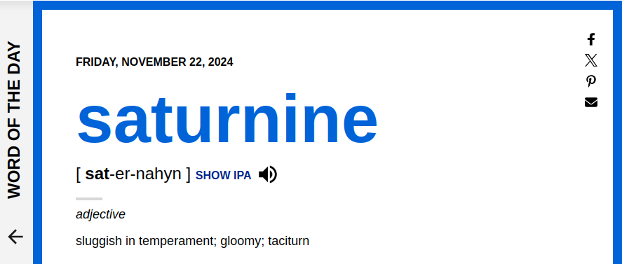

# Word Of The Day Skill

Get Word of the Day from [Dictionary.com.](Dictionary.com)

> NOTE: Dictionary.com is english only, this skill will use machine translation for other languages.

###  Usage
* "tell me the word of the day"
* "word of the day"
* "word of day"

###  Credits 
* [Fatima Mohamed - skill idea](https://github.com/adropofilm/word-of-the-day-skill)
* Dictionary.com 
