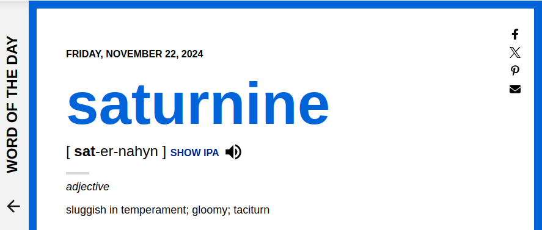

# Word Of The Day Skill

This OVOS skill speaks the word of the day. It gets the word from [Dictionary.com](https://Dictionary.com) for English, the French [Wiktionnaire](https://fr.wiktionary.org/), [Dicionário Priberam](https://dicionario.priberam.org/) for Portuguese, [Portal das Palabras](https://portaldaspalabras.gal/) for Galician, or [RodaMots.cat](https://rodamots.cat/) for Catalan.



The skill supports English, French, Portuguese, Galician, and Catalan only. In any other language, it speaks an error. Open an issue or a pull request if you have a website suggestion for your language.

## Install

Install the skill with pip:

```bash
pip install ovos-skill-word-of-the-day
```

## Usage

Say one of these phrases:

* "tell me the word of the day"
* "word of the day"
* "word of day"

## Credits

* [Fatima Mohamed - skill idea](https://github.com/adropofilm/word-of-the-day-skill)

## License

This skill is available under the [Apache License 2.0](LICENSE).
